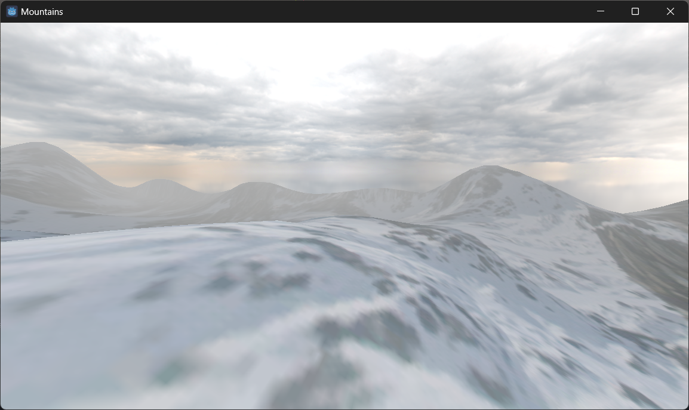

# Godot Engine
This repository contains several demo projects created with the Godot Engine.

## Demos
### Beach
Demo testing some natural assets like water, as well as how to constraint the player movements inside a navigable area.

### Mountains
This demo experiments a simple terrain generation based on heightmap, with a matching collider generated on runtime from a script.

### Survival demo
This is a small demo showing a survival game scene, where a character need to explore a laboratory.

