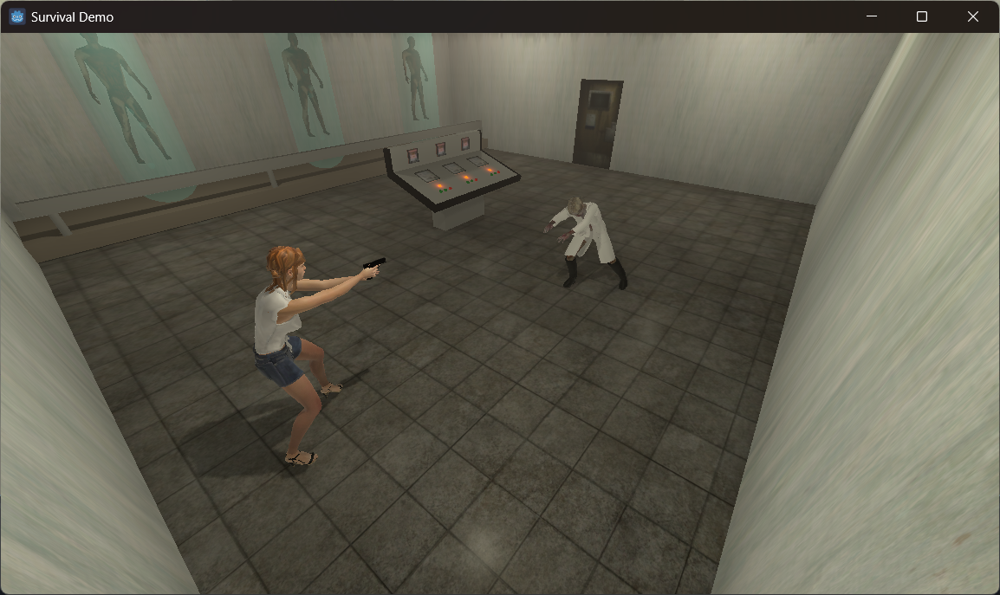
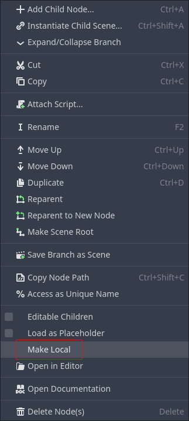

# Godot Engine
This repository contains several demo projects created with the Godot Engine.

## Demos
### Survival demo
This is a small demo showing a survival game scene, where a character need to explore a laboratory.

## Godot engine useful tips

### Editor
Below are several useful shortcuts to navigate in the editor:
- **[Mouse wheel]** Can be used to  zoom in or out in the scene.
- **[Middle mouse button]** When pressed and mouse is dragged, allows to rotate around the current target.
- **[Shift]+[Middle mouse button]** When pressed and mouse is dragged, pan the camera up, down, left or right.
- **[Right mouse button]** When pressed and mouse is dragged, rotate the camera in place.
- **[Shift]+[F]** To toggle between the free navigation mode and the normal mode. In the free navigation mode, you can navigate in the scene with the **[W][A][S][D]** keys and the **mouse**.

### Remove the read-only limitation on importing assets
Whan a model or a scene is imported from a glTF asset, it is added as a read-only asset in the scene. To allow this asset to be modified from within Godot, right-click it in the scene hierarchy and select the *Make Local* option.

